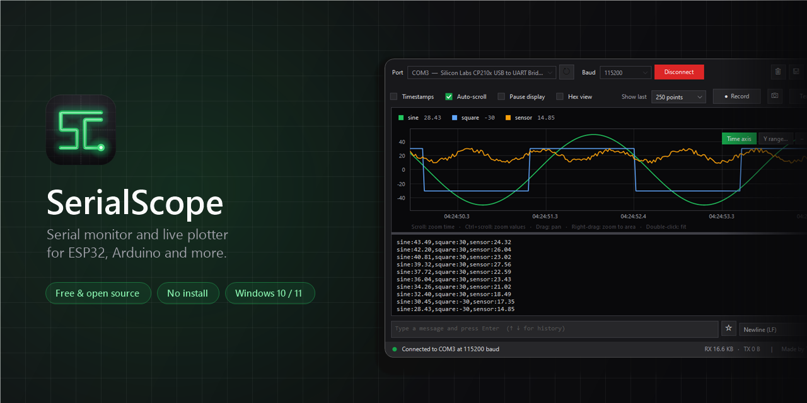
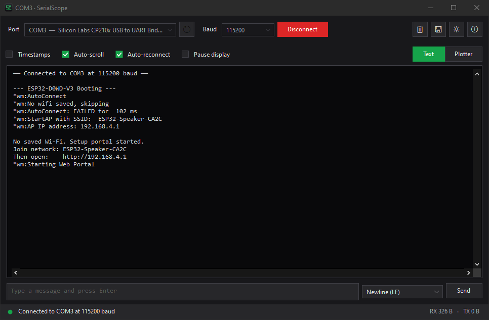
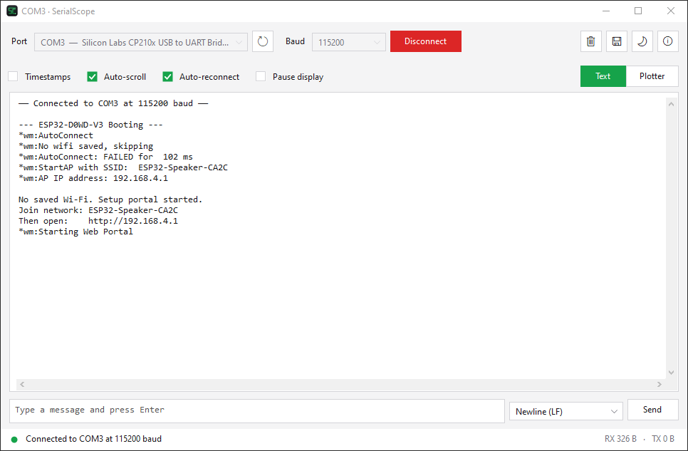
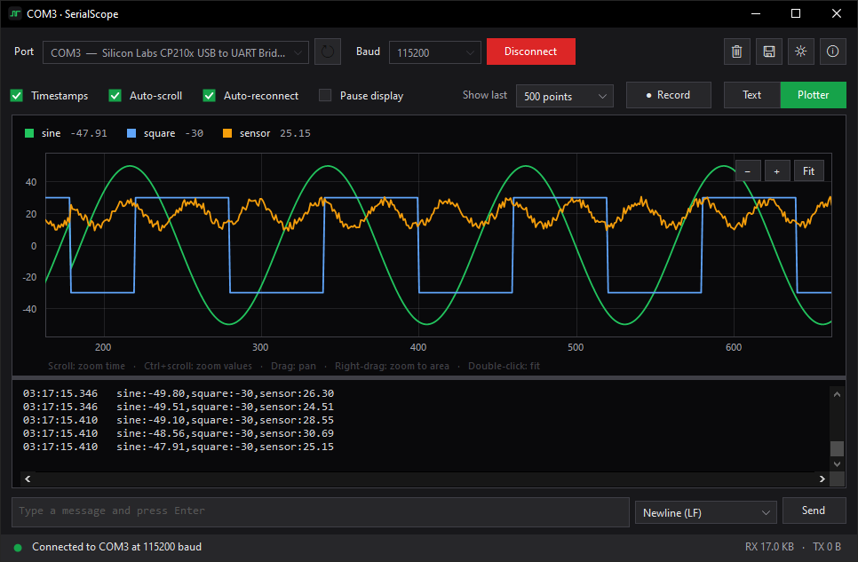

<p align="center">
  
</p>

<p align="center">
  <a href="https://github.com/Tjs4002/SerialScope/releases/latest"></a>
  <a href="https://github.com/Tjs4002/SerialScope/releases"></a>
  <a href="https://github.com/Tjs4002/SerialScope/actions/workflows/build.yml"></a>
  
  <a href="LICENSE"></a>
</p>

<p align="center">
  <a href="https://github.com/Tjs4002/SerialScope/releases/latest"><b>Download</b></a>
  &nbsp;·&nbsp;
  <a href="#features"><b>Features</b></a>
  &nbsp;·&nbsp;
  <a href="#plotter"><b>Plotter</b></a>
  &nbsp;·&nbsp;
  <a href="#build-from-source"><b>Build</b></a>
  &nbsp;·&nbsp;
  <a href="#faq"><b>FAQ</b></a>
</p>

<br>

**SerialScope** is a fast, good-looking serial monitor and plotter for Windows. Open it, pick your board's port and see what it's saying, as text or as live graphs. It's a single `.exe` of about 150 KB, with nothing to install.

<table>
  <tr>
    <td width="33%" valign="top">
      <h3>⚡ Instant</h3>
      One small file that opens in a blink. No installer, no runtime to download, no account.
    </td>
    <td width="33%" valign="top">
      <h3>📈 Live plotter</h3>
      Numbers become scrolling graphs, using the Arduino Serial Plotter format. Zoom, pan, hover and record to CSV.
    </td>
    <td width="33%" valign="top">
      <h3>🔌 Board friendly</h3>
      Connecting doesn't reset your ESP32 or Arduino, and it reconnects by itself after you unplug or reflash.
    </td>
  </tr>
</table>

## Features

**Connecting**
- **Port picker with device names:** shows `COM3 — Silicon Labs CP210x…` instead of a bare number, and updates when you plug devices in or out.
- **Any baud rate:** 300 to 2,000,000 built in, plus **Custom…** for anything else.
- **Auto-reconnect:** unplug the board or flash new firmware, and SerialScope picks it back up when the port returns.
- **No surprise resets:** DTR and RTS stay low, so your board keeps running when you connect.

**Reading**
- **Error and warning highlighting:** errors in red, warnings in amber and debug lines dimmed. Understands ESP-IDF (`E (123) wifi:`) and Arduino-ESP32 (`[E][main.cpp:42]`) logs out of the box.
- **Search** with <kbd>Ctrl</kbd> + <kbd>F</kbd>: every match highlighted, with next/previous and a match count.
- **Hex view** for binary devices: offsets, raw bytes and printable characters.
- **Live plotter** with zoom, pan, box zoom, hover values, a time axis and fixed ranges. See [Plotter](#plotter).
- **Record to CSV** for Excel, Google Sheets or Python, and **save graphs** as PNG images.
- **Timestamps** to the millisecond, and **Pause display** without losing data.

**Sending**
- **Send box** with a choice of line ending.
- **History:** <kbd>↑</kbd> / <kbd>↓</kbd> bring back the last 50 messages.
- **Saved commands:** keep the messages you send often one click away (★ button).

**Comfort**
- **Session logs:** optionally save everything to `Documents\SerialScope\Logs`, one file per connection.
- **Update notice** in the status bar when a new version is out.
- **Dark and light themes,** right down to the title bar, scroll bars and menus.
- **Keyboard shortcuts** and adjustable text size.
- **Remembers everything:** port, baud rate, theme, view, options, history and window size.

<table>
  <tr>
    <td></td>
    <td></td>
  </tr>
  <tr>
    <td align="center"><sub>Dark theme</sub></td>
    <td align="center"><sub>Light theme</sub></td>
  </tr>
</table>

## Download

1. Open the [**latest release**](https://github.com/Tjs4002/SerialScope/releases/latest).
2. Download **`SerialScope.exe`**.
3. Run it. That's all.

**With [Scoop](https://scoop.sh):**

```powershell
scoop install https://github.com/Tjs4002/SerialScope/releases/latest/download/serialscope.json
```

Each release also includes `SHA256SUMS.txt`, so you can check your download with `Get-FileHash SerialScope.exe`.

> [!NOTE]
> **"Windows protected your PC"?** SerialScope isn't code-signed yet, so SmartScreen may warn you the first time. Click **More info → Run anyway**. Prefer not to trust a downloaded binary? [Build it yourself](#build-from-source) in a few seconds; every release is also built publicly by [GitHub Actions](https://github.com/Tjs4002/SerialScope/actions).

**Requirements:** Windows 10 or 11. Windows 7 and 8.1 with .NET Framework 4.5 or later should also work.

## Quick start

1. Plug in your board and choose its **Port**.
2. Pick the **Baud** rate from your code, e.g. `115200` for `Serial.begin(115200)`.
3. Click **Connect**, or press <kbd>F5</kbd>.

> [!TIP]
> Only one program can use a COM port at a time. Click **Disconnect** before uploading from the Arduino IDE, PlatformIO or esptool, then connect again afterwards.

## Plotter

<p align="center">
  
</p>

Click **Plotter** (or press <kbd>Ctrl</kbd> + <kbd>2</kbd>). Print one reading per line, in the same format as the Arduino Serial Plotter:

```cpp
Serial.println(analogRead(A0));                 // one line on the graph
Serial.printf("%d %d %d\n", x, y, z);           // three lines: Value 1, Value 2, Value 3
Serial.printf("temp:%.1f,hum:%.1f\n", t, h);    // named lines: temp and hum
```

Values can be separated by spaces, commas or tabs. Text lines such as log messages are left out of the graph but still show in the text panel underneath it.

Want to try it now? Flash [`examples/PlotterDemo`](examples/PlotterDemo/PlotterDemo.ino) to any Arduino-compatible board.

| Action | How |
|---|---|
| Zoom time | Scroll wheel, or the **−** / **+** buttons |
| Zoom values | <kbd>Ctrl</kbd> + scroll wheel |
| Scroll back through history | Drag sideways, then **Live ▸** to return to the newest data |
| Zoom into an area | Right-drag a box |
| Fit everything | Double-click, or **Fit** |
| Exact values | Hover over the graph |
| Hide or show a line | Click its name in the legend |
| Record to CSV | **● Record**, then **■ Stop** to save |
| Save the graph as an image | Camera button next to **Record** |
| Clock time on the bottom axis | **Time axis** button on the graph |
| Fixed value range (e.g. 0–4095) | **Y range…** button on the graph; **Automatic** to undo |

## Highlighting, search and hex view

- **Highlighting** colours whole lines: red for errors, amber for warnings, dimmed for debug output. It recognises ESP-IDF logs (`E (1234) wifi: …`), Arduino-ESP32 logs (`[  1234][W][main.cpp:42] …`) and lines containing words like *error*, *panic*, *failed* or *timeout*. Turn it off under ⚙ **Settings**.
- **Search** (<kbd>Ctrl</kbd> + <kbd>F</kbd>) highlights every match. <kbd>Enter</kbd> / <kbd>Shift</kbd> + <kbd>Enter</kbd> (or <kbd>F3</kbd>) jump between them; <kbd>Esc</kbd> closes the bar. Auto-scroll pauses while you search.
- **Hex view** shows 16 bytes per line with the offset, the bytes in hex and their printable characters, for GPS modules, Modbus devices and other binary protocols.

Try them with [`examples/LogDemo`](examples/LogDemo/LogDemo.ino): it prints log lines at every level, answers what you send, and sends raw bytes when you type `binary`.

## Keyboard shortcuts

| Shortcut | Action |
|---|---|
| <kbd>F5</kbd> | Connect / disconnect |
| <kbd>Ctrl</kbd> + <kbd>1</kbd> / <kbd>2</kbd> | Text view / Plotter |
| <kbd>Ctrl</kbd> + <kbd>F</kbd> | Find in output |
| <kbd>F3</kbd> / <kbd>Shift</kbd> + <kbd>F3</kbd> | Next / previous match |
| <kbd>Ctrl</kbd> + <kbd>L</kbd> | Clear output and graph |
| <kbd>Ctrl</kbd> + <kbd>S</kbd> | Save log |
| <kbd>Ctrl</kbd> + <kbd>+</kbd> / <kbd>−</kbd> / <kbd>0</kbd> | Bigger / smaller / default text size |
| <kbd>Enter</kbd> in the send box | Send |
| <kbd>↑</kbd> / <kbd>↓</kbd> in the send box | Previous / next sent message |

## Build from source

No Visual Studio or SDK needed: the C# compiler already ships with Windows.

```bat
git clone https://github.com/Tjs4002/SerialScope.git
cd SerialScope
build.bat
```

The app is written to `bin\SerialScope.exe`.

<details>
<summary><b>Project layout</b></summary>

```
SerialScope/
├── src/
│   ├── MainForm.cs        Main window: connection, output, sending, settings
│   ├── OutputView.cs      Coloured output, highlighting rules and search
│   ├── PlotView.cs        Live graph with zoom, pan, time axis and hover values
│   ├── Recorder.cs        Records plotted readings to CSV
│   ├── UpdateChecker.cs   Checks GitHub for a newer release
│   ├── Controls.cs        Themed buttons, drop-downs, check boxes, menus
│   ├── Theme.cs           Dark and light colour palettes
│   ├── PortInfo.cs        Port list with friendly device names
│   ├── Settings.cs        Saved preferences (%APPDATA%\SerialScope\settings.ini)
│   ├── AboutForm.cs       About dialog
│   ├── CustomBaudForm.cs  Custom baud rate dialog
│   ├── RangeForm.cs       Plotter value range dialog
│   ├── AppInfo.cs         Name, version, author, links
│   ├── Program.cs         Entry point
│   ├── app.ico            Application icon
│   └── app.manifest       DPI awareness and modern Windows controls
├── examples/
│   ├── PlotterDemo        Prints test waveforms for the plotter
│   └── LogDemo            Prints log levels and answers commands
├── packaging/             Scoop manifest template (winget manifests are generated)
├── tools/                 Icon, banner and winget manifest generators
├── docs/                  Screenshots and README images
└── build.bat              One-step build
```
</details>

## FAQ

<details>
<summary><b>It says the port is busy or in use.</b></summary>

Another program has the port open: usually the Arduino IDE's Serial Monitor, an upload in progress, or a second copy of SerialScope. Close it and click **Connect** again.
</details>

<details>
<summary><b>I only see garbage characters.</b></summary>

The baud rate doesn't match your code. Pick the same number you used in `Serial.begin(...)`. ESP32 boot messages use 115200.
</details>

<details>
<summary><b>My board doesn't appear in the port list.</b></summary>

Try a different USB cable (many are charge-only), then install the driver for your board's USB chip. That's usually the **CP210x** (Silicon Labs) or **CH340** (WCH); the chip name is printed on the board next to the USB port.
</details>

<details>
<summary><b>The plotter says "Waiting for numbers".</b></summary>

Each line must contain only numbers, optionally with names, like `23.5`, `1 2 3` or `temp:23.5,hum:41`. Lines with other text are shown in the text panel but not plotted.
</details>

<details>
<summary><b>Does SerialScope connect to the internet?</b></summary>

Only to check for updates: at most twice a day it asks GitHub's public API for the latest release version. No data about you or your devices is sent. Turn it off under ⚙ **Settings → Check for updates automatically**.
</details>

<details>
<summary><b>Where are session logs saved?</b></summary>

In `Documents\SerialScope\Logs`, one file per connection named after the port and time (e.g. `COM3-2026-10-04-143012.txt`). Turn them on and open the folder from ⚙ **Settings**.
</details>

<details>
<summary><b>Does it work on macOS or Linux?</b></summary>

Not yet. SerialScope uses Windows' built-in tools to stay tiny and install-free. A cross-platform version may come later; [open an issue](https://github.com/Tjs4002/SerialScope/issues) if you'd use it.
</details>

## Contributing

Bug reports, ideas and pull requests are welcome. Start with an [issue](https://github.com/Tjs4002/SerialScope/issues/new/choose), and see [CONTRIBUTING.md](CONTRIBUTING.md) for how to build and submit changes.

If SerialScope saves you time, a ⭐ on the repo helps other people find it.

## License

Released under the [MIT License](LICENSE). © 2026 Tjs4002
